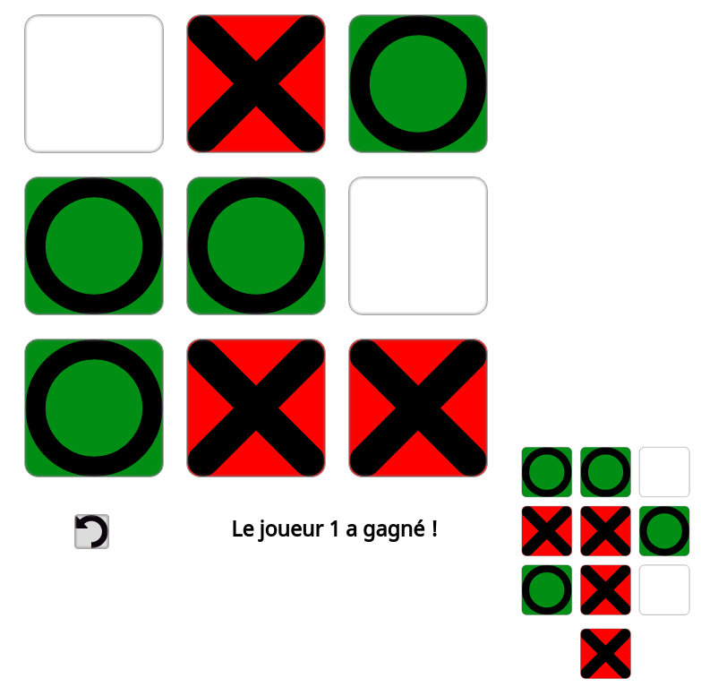

Context : Aformac training for professionnal title Software developper

# Programming in PHP : Tic Tac Toe

## ~ PHP Practice ~

> Code a tic tac toe game using PHP langage only, player versus player.

As it is a PHP page and GitHub won't host it, you'll have to download it and run it on your server to see it work.

*Hint : **You have to validate your move with the bottom button.** *
